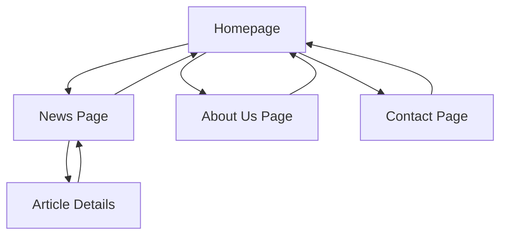

## 1. Product Overview
GeeksProductionStudio is a sophisticated website showcasing a tech-focused production studio. The platform presents the studio's portfolio, latest news, and contact information with a dark, geekish aesthetic that appeals to tech enthusiasts and potential clients.

The website serves as the primary digital presence for the studio, enabling visitors to explore services, view recent projects, and connect with the team through a seamless, modern interface.

## 2. Core Features

### 2.1 User Roles
No user registration required - this is a public-facing informational website.

### 2.2 Feature Module
GeeksProductionStudio website consists of the following main pages:
1. **Homepage**: Hero section, featured projects, services overview, and navigation.
2. **News page**: Latest studio updates, project announcements, and tech insights.
3. **About Us page**: Company story, team members, mission, and values.
4. **Contact page**: Contact form, location details, and social media links.

### 2.3 Page Details
| Page Name | Module Name | Feature description |
|-----------|-------------|---------------------|
| Homepage | Hero section | Display animated tech-themed background with studio name and tagline. Include call-to-action buttons for portfolio and contact. |
| Homepage | Featured Projects | Showcase latest 3-4 projects with hover effects, project titles, and brief descriptions. |
| Homepage | Services Overview | Present studio services like web development, app creation, and tech consulting with icons and descriptions. |
| Homepage | Navigation | Fixed header with smooth scroll navigation to all pages and sections. |
| News page | Article List | Display news articles in reverse chronological order with featured images, titles, and excerpts. |
| News page | Article Filter | Enable filtering by categories like Projects, Technology, Company News. |
| News page | Article Details | Show full article content, publication date, author, and related articles when clicking on news items. |
| About Us page | Company Story | Present the studio's founding story, growth journey, and key milestones in timeline format. |
| About Us page | Team Members | Display team member profiles with photos, roles, and brief bios in a grid layout. |
| About Us page | Mission & Values | Highlight company mission statement and core values with visual elements. |
| Contact page | Contact Form | Include form fields for name, email, subject, and message with validation and submission feedback. |
| Contact page | Location Details | Show studio address, phone number, email, and embedded map view. |
| Contact page | Social Links | Display social media icons linking to studio profiles with hover animations. |

## 3. Core Process
Visitors can navigate through the website seamlessly:
1. Land on Homepage with immersive hero section showcasing studio identity
2. Explore featured projects and services overview
3. Navigate to News page to read latest updates and announcements
4. Visit About Us to learn company story and meet the team
5. Access Contact page to reach out for collaborations or inquiries
6. Use smooth scroll navigation and interactive elements throughout

## 4. User Interface Design

### 4.1 Design Style
- **Primary Colors**: Deep charcoal (#1a1a1a), electric blue (#00d4ff), neon green (#39ff14)
- **Secondary Colors**: Dark gray (#2d2d2d), light gray (#b3b3b3), white (#ffffff)
- **Button Style**: Rounded corners with glowing hover effects and tech-inspired borders
- **Typography**: Monospace fonts for headers (Fira Code, JetBrains Mono), clean sans-serif for body text
- **Layout Style**: Card-based design with grid layouts, dark backgrounds with neon accents
- **Icons**: Tech-themed icons using Font Awesome or custom SVG icons with glowing effects

### 4.2 Page Design Overview
| Page Name | Module Name | UI Elements |
|-----------|-------------|-------------|
| Homepage | Hero section | Full-screen dark background with animated binary/matrix effect, glowing text overlay, floating tech particles, and prominent CTA buttons with neon borders. |
| Homepage | Featured Projects | Dark card containers with hover-activated neon borders, project thumbnails with overlay effects, and smooth fade-in animations on scroll. |
| Homepage | Services Overview | Icon-based service cards with electric blue accents, hover animations revealing service descriptions, arranged in responsive grid layout. |
| News page | Article List | Dark card layout for articles, featured image thumbnails, publication dates with neon accents, infinite scroll or pagination controls. |
| News page | Article Filter | Tech-style toggle buttons or dropdown with glowing active states, smooth filter animations. |
| About Us page | Company Story | Timeline design with glowing milestone markers, animated progress indicators, and parallax scrolling effects. |
| About Us page | Team Members | Circular profile images with neon ring borders, hover cards revealing member details, grid layout with smooth animations. |
| Contact page | Contact Form | Dark input fields with glowing focus states, validation feedback with tech-style notifications, submit button with loading animation. |
| Contact page | Location Details | Embedded dark-themed map, contact information cards with icon indicators, social media icons with hover glow effects. |

### 4.3 Responsiveness
- **Desktop-first approach**: Optimized for 1920x1080 and larger displays
- **Mobile adaptation**: Responsive breakpoints at 1024px, 768px, and 480px
- **Touch optimization**: Larger tap targets on mobile, swipe gestures for image galleries
- **Performance**: Lazy loading for images, optimized animations for mobile devices

### 4.4 3D Scene Guidance
Not applicable - this is a 2D website with tech-themed visual effects rather than 3D content.