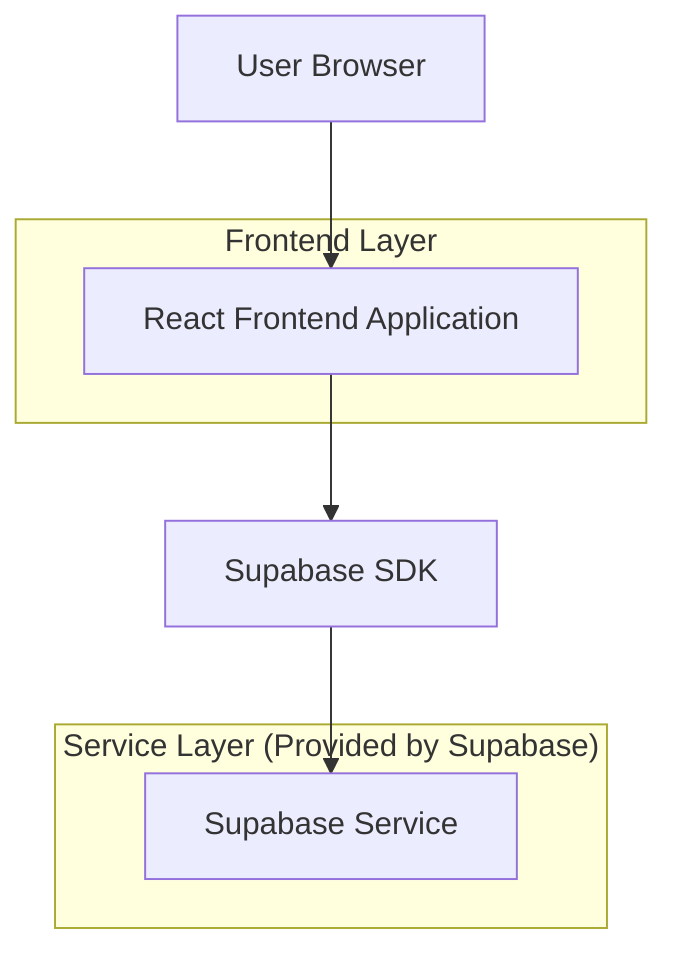
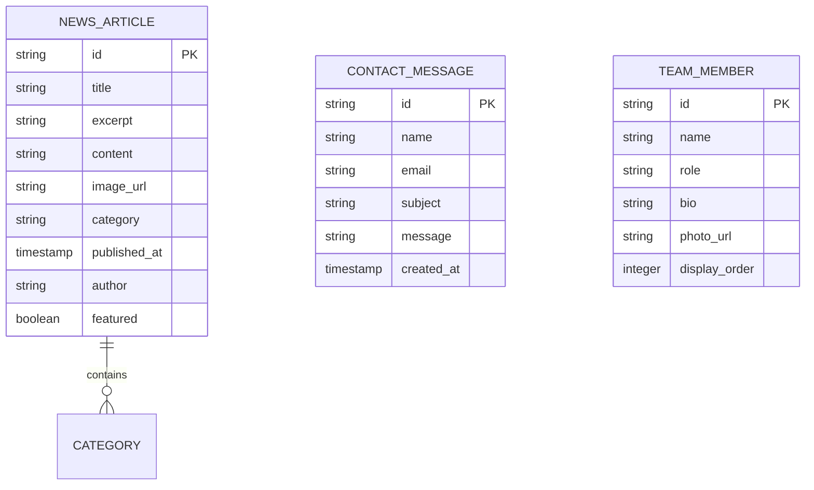

## 1. Architecture design



## 2. Technology Description
- Frontend: React@18 + tailwindcss@3 + vite
- Initialization Tool: vite-init
- Backend: Supabase (for content management and contact form submissions)
- Database: Supabase PostgreSQL (for news articles and contact messages)

## 3. Route definitions
| Route | Purpose |
|-------|---------|
| / | Homepage, displays hero section, featured projects, and services |
| /news | News page, lists all news articles with filtering options |
| /news/:id | Individual news article details |
| /about | About Us page, company story and team information |
| /contact | Contact page with form and location details |

## 4. API definitions
### 4.1 Core API

News articles management
```
GET /api/news
```

Response:
| Param Name| Param Type  | Description |
|-----------|-------------|-------------|
| id        | string      | Article unique identifier |
| title     | string      | Article title |
| excerpt   | string      | Brief article description |
| content   | string      | Full article content |
| image_url | string      | Featured image URL |
| category  | string      | Article category |
| published_at | date     | Publication date |
| author    | string      | Article author |

Contact form submission
```
POST /api/contact
```

Request:
| Param Name| Param Type  | isRequired  | Description |
|-----------|-------------|-------------|-------------|
| name      | string      | true        | Contact person's name |
| email     | string      | true        | Contact email address |
| subject   | string      | true        | Message subject |
| message   | string      | true        | Message content |

Response:
| Param Name| Param Type  | Description |
|-----------|-------------|-------------|
| status    | boolean     | Submission success status |
| message   | string      | Response message |

## 5. Server architecture diagram
Not applicable - using Supabase as Backend-as-a-Service without custom server implementation.

## 6. Data model

### 6.1 Data model definition


### 6.2 Data Definition Language
News Articles Table (news_articles)
```sql
-- create table
CREATE TABLE news_articles (
    id UUID PRIMARY KEY DEFAULT gen_random_uuid(),
    title VARCHAR(255) NOT NULL,
    excerpt TEXT NOT NULL,
    content TEXT NOT NULL,
    image_url VARCHAR(500),
    category VARCHAR(50) NOT NULL,
    published_at TIMESTAMP WITH TIME ZONE DEFAULT NOW(),
    author VARCHAR(100) NOT NULL,
    featured BOOLEAN DEFAULT false,
    created_at TIMESTAMP WITH TIME ZONE DEFAULT NOW(),
    updated_at TIMESTAMP WITH TIME ZONE DEFAULT NOW()
);

-- create indexes
CREATE INDEX idx_news_published_at ON news_articles(published_at DESC);
CREATE INDEX idx_news_category ON news_articles(category);
CREATE INDEX idx_news_featured ON news_articles(featured);

-- set up Row Level Security
ALTER TABLE news_articles ENABLE ROW LEVEL SECURITY;

-- policies for public read access
CREATE POLICY "Public can read news articles" ON news_articles
    FOR SELECT USING (true);
```

Contact Messages Table (contact_messages)
```sql
-- create table
CREATE TABLE contact_messages (
    id UUID PRIMARY KEY DEFAULT gen_random_uuid(),
    name VARCHAR(100) NOT NULL,
    email VARCHAR(255) NOT NULL,
    subject VARCHAR(200) NOT NULL,
    message TEXT NOT NULL,
    created_at TIMESTAMP WITH TIME ZONE DEFAULT NOW()
);

-- create index
CREATE INDEX idx_contact_created_at ON contact_messages(created_at DESC);

-- set up Row Level Security
ALTER TABLE contact_messages ENABLE ROW LEVEL SECURITY;

-- policies for authenticated users to manage messages
CREATE POLICY "Authenticated users can insert contact messages" ON contact_messages
    FOR INSERT WITH CHECK (true);
```

Team Members Table (team_members)
```sql
-- create table
CREATE TABLE team_members (
    id UUID PRIMARY KEY DEFAULT gen_random_uuid(),
    name VARCHAR(100) NOT NULL,
    role VARCHAR(100) NOT NULL,
    bio TEXT NOT NULL,
    photo_url VARCHAR(500),
    display_order INTEGER DEFAULT 0,
    created_at TIMESTAMP WITH TIME ZONE DEFAULT NOW(),
    updated_at TIMESTAMP WITH TIME ZONE DEFAULT NOW()
);

-- create index
CREATE INDEX idx_team_display_order ON team_members(display_order);

-- set up Row Level Security
ALTER TABLE team_members ENABLE ROW LEVEL SECURITY;

-- policies for public read access
CREATE POLICY "Public can read team members" ON team_members
    FOR SELECT USING (true);
```

-- Grant permissions
GRANT SELECT ON news_articles TO anon;
GRANT SELECT ON team_members TO anon;
GRANT INSERT ON contact_messages TO anon;